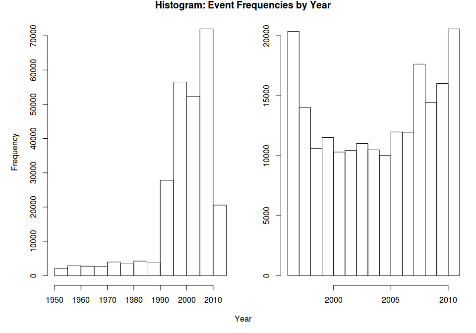
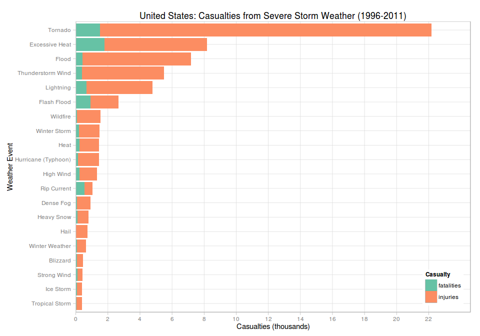

# Impact of Severe Storm Events

## Synopsis

In this report we explore the NOAA Storm Database for the effects that severe 
storm weather has had to both people and property. The data comes from the 
United States [National Weather Service](http://www.weather.gov/) and covers the
period from 1950 to 2011.  However, we selected only events between 1996 and 
2011 as that was when a [larger range of weather events](#events) were first 
being measured. We found that the greatest number of casualties (as measured by
injury or fatality) occurred during 
[tornados](#what-events-had-the-most-casualties). We also found that the 
greatest economic cost occurred as a consequence of 
[floods](#what-events-had-the-greatest-economic-cost).

## Data Processing

Storm Data begins in 1950 and ends in November 2011. The following sections will
read and process [Storm Data](#data) to obtain casualty and economic damage 
measurements. As this anaylsis is only looking at the most severe impacts of
weather events we have made a number of simplifying assumptions:

* we are looking at the entire USA and not focused on location specifics of 
state, county or marine region

* the weather [events](#events) types are messy, but will not be modified. Let
us first see the broader picture of effects of severe weather.


```r
# set our runtime environment and global defaults.
require(knitr, quietly = TRUE)
require(utils, quietly = TRUE)
require(stringr, quietly = TRUE)
require(dplyr, quietly = TRUE)
require(reshape2, quietly = TRUE)
require(ggplot2, quietly = TRUE)
require(scales, quietly = TRUE)
opts_chunk$set(echo = TRUE, cache = TRUE, cache.path = "cache/", 
               fig.width = 10, fig.height = 7, fig.path = "figure/")
```

### Download Storm Data

Download and load [Storm Data](#data) which is a `bzip2` archive containing a
storm data `CSV` records.


```r
# download archive into local directory
archiveName <- file.path("stormdata.csv.bz2")
if (!file.exists(archiveName)) {
    archiveUrl <- "https://d396qusza40orc.cloudfront.net/repdata%2Fdata%2FStormData.csv.bz2"
    download.file(archiveUrl, destfile = archiveName, method = "curl", mode = "wb")
    print(paste(Sys.time(), "archive downloaded"))
}
if(!exists("stormdata")) {
    stormdata <- read.csv(archiveName, stringsAsFactors = FALSE)
}
```

### Subset Storm Data

Subset data for the columns required for analysis of casualties and damages. Not
all fields contained in the dataset are relevant for this exploration.

The column names were set to lowercase and cast to appropriate classes.


```r
# only need a subset of fields from storm data for this analysis
data <- stormdata[, c("EVTYPE", "BGN_DATE", "FATALITIES", "INJURIES",
                      "PROPDMG", "PROPDMGEXP", "CROPDMG", "CROPDMGEXP")]

# cleanup and lowercase column names
names(data) <- tolower(names(data))
names(data) <- gsub("_", "", names(data))

# convert string to date
data <- transform(data, bgndate = as.Date(bgndate, format= "%m/%d/%Y 0:00:00", tz = "C"))

# remove records where no casualties or damages have been recorded
data <- data %>% filter(!(fatalities == 0 & injuries == 0 & propdmg == 0 & cropdmg == 0))
```

### Events

There are several issues with this Storm Data. This analysis will not address 
these issues, other than to highlight them and note that they should be
considered when evaluating these [results](#results):

* event types - there are more [event
  types](http://www.ncdc.noaa.gov/stormevents/details.jsp?type=eventtype) than
  the offical list
* provenance - multiple sources that have not been guarenteed by the NWS

From 1950 to 1995 only Tornado, Thunderstorm Wind and Hail weather events were
being recorded. Then in 1996 the [NWS Directive 
10-1605](http://www.ncdc.noaa.gov/stormevents/pd01016005curr.pdf) introduced 48 
standardised event types. So this analysis will use data from 1996 to 2011.


```r
# plot combined histogram of events before and after
data <- transform(data, year = strtoi(format(data$bgndate, "%Y")))

# show change in event frequency if we remove all invalid event types
par(mfrow = c(1, 2), mar = c(3, 4, 1, 1), oma = c(2, 1, 1, 0))

# histogram of events 1950 to 2011
hist(data$year, main = "", xlab = "")

# use data from 1996
data <- data %>% filter(year >= 1996)

# histogram of events from 1996 to 2011
hist(data$year, main = "", ylab = "", xlab = "")
title(main = "Histogram: Event Frequencies by Year", outer = TRUE)
mtext("Year", side = 1, outer = TRUE)
```

 

As per NWS Directive 10-1605 there are only 48 valid event types as listed in 
[Table 1, Section 2.1.1 "Storm Data Event Table", National Weather Service Storm
Data Documentation](#documentation). See also [Event Types 
Available](http://www.ncdc.noaa.gov/stormevents/details.jsp?type=eventtype). 


```r
# use title-case for pretty reports
data <- transform(data, evtype = str_to_title(str_trim(evtype)))

# how many different event types do we have here?
evcount <- length(unique(data$evtype))
```

In our subset we have ``183`` distinct event types.

### Casualties

Prepare a data frame of total casualties, (composed of fatalties and injuries).
The report will list weather events in descending order of total casualties.


```r
# summarise by event type, and total is used to order results
casualty <- data %>%
    mutate(total = fatalities + injuries) %>%
    filter(total > 0) %>%
    select(evtype, total, fatalities, injuries) %>%
    group_by(evtype) %>%
    summarise(total = sum(total), fatalities = sum(fatalities), injuries = sum(injuries))

# melt into long format to help with plotting
casualty <- melt(casualty, id.vars = c("evtype", "total"), variable.name = "casualties")
casualty <- transform(casualty, casualties = factor(casualties))
```

### Economic Damages

The property and crop damage exponents are documented in Section 2.7 "Damage",
[National Weather Service Storm Data
Documentation](https://d396qusza40orc.cloudfront.net/repdata%2Fpeer2_doc%2Fpd01016005curr.pdf)

They are: **K** for thousands ($10^3$), **M** for millions ($10^6$), **B** for
billions ($10^9$).

The following will map `propdmgexp` and `cropdmgexp` from a character to the 
associated numeric value. We will then update the property (`propdmg`) and crop 
(`cropdmg`) damage estimates using these converted exponents.


```r
# convert damage exponents to associated numerics
# where strtoi() will convert "" to 0
data$propdmgexp <- strtoi(chartr("KMB", "369", data$propdmgexp))
data$cropdmgexp <- strtoi(chartr("KMB", "369", data$cropdmgexp))

# update damage using translated exponents, where 10^0 = 1 (i.e. no change)
options(scipen = 20)
data$propdmg <- data$propdmg * 10^data$propdmgexp
data$cropdmg <- data$cropdmg * 10^data$cropdmgexp
```

Prepare a data frame of total damages, (composed of crop and property damage
estimates in USD). The report will list event types in descending order of total
damages.


```r
# summarise by event type, and total is used to order results
damage <- data %>%
    mutate(total = propdmg + cropdmg) %>%
    filter(total > 0) %>%
    select(evtype, total, propdmg, cropdmg) %>%
    group_by(evtype) %>%
    summarise(total = sum(total), property = sum(propdmg), crop = sum(cropdmg))

# melt into long format to help with plotting
damage <- melt(damage, id.vars = c("evtype", "total"), variable.name = "damages")
damage <- transform(damage, damages = factor(damages))
```

## Results

Looking at the results, it is clear that some attention could be made to address
the  messy [event types](#events), but this is unlikely to effect the ranking if
the most severe.

### What events had the most casualties?

The total number of casualties (fatalities and injuries) were counted from 1996 
to 2011. Total casualties were then sorted in descending order. The top events
that cause the greatest loss of life or injury are:


```r
# order by most severe events
casualty <- arrange(casualty, desc(total))

# show n = 10  events by casualty in descending order (first 2*n rows since long format)
casualty[1:(2*10),] %>%
    ggplot(aes(x = reorder(evtype, total), y = value/1000, fill = casualties)) +
    geom_bar(stat = "identity", position = "stack") +
    coord_flip() +
    theme_light(base_family = "sans", base_size = 11) +
    theme(legend.justification = c(1, 0), legend.position = c(1, 0)) +
    scale_fill_brewer(name = "Casualty", palette = "Set2") +
    scale_x_discrete(name = "Weather Event") +
    scale_y_discrete(name = "Casualties (thousands)", breaks = pretty_breaks(n = 10)) +
    ggtitle("United States: Casualties from Severe Storm Weather (1996-2011)")
```

 

### What events had the greatest economic cost? 

All Crop and property damage estimates were summed from 1996 to 2011. Total 
costs were then sorted in descending order. The top events that incur the 
greatest economic cost are:


```r
# order by most severe events
damage <- arrange(damage, desc(total))

# show n = 10 events by damages in descending order (first 2*n rows since long format)
damage[1:(2*10),] %>%
    ggplot(aes(x = reorder(evtype, total), y = value/10^9, fill = damages)) +
    geom_bar(stat = "identity", position = "stack") +
    coord_flip() +
    theme_light(base_family = "sans", base_size = 11) +
    theme(legend.justification = c(1, 0), legend.position = c(1, 0)) +
    scale_fill_brewer(name = "Damage", palette = "Set2") +
    scale_x_discrete(name = "Weather Event") +
    scale_y_continuous(name = "Damages (estimate in USD Billions)", breaks = pretty_breaks(n = 10)) +
    ggtitle("United States: Economic Damages from Severe Storm Weather (1996-2011)")
```

 

## Appendices

### 

### Data

* [Storm Data](https://d396qusza40orc.cloudfront.net/repdata%2Fdata%2FStormData.csv.bz2)
[47Mb] 

### Code

* all code and associated documentation is available on GitHub from [here](https://github.com/frankhjung/repdata-project2).

### Documentation

* National Weather Service [Storm Data Documentation](https://d396qusza40orc.cloudfront.net/repdata%2Fpeer2_doc%2Fpd01016005curr.pdf)

* National Climatic Data Center Storm Events
[FAQ](https://d396qusza40orc.cloudfront.net/repdata%2Fpeer2_doc%2FNCDC%20Storm%20Events-FAQ%20Page.pdf)

### Session Information

This document was produced in RStudio. The session information detailing
packages used is:


```r
sessionInfo()
```

```
## R version 3.2.0 (2015-04-16)
## Platform: x86_64-pc-linux-gnu (64-bit)
## Running under: Linux Mint LMDE
## 
## locale:
##  [1] LC_CTYPE=en_AU.UTF-8       LC_NUMERIC=C              
##  [3] LC_TIME=en_AU.UTF-8        LC_COLLATE=en_AU.UTF-8    
##  [5] LC_MONETARY=en_AU.UTF-8    LC_MESSAGES=en_AU.UTF-8   
##  [7] LC_PAPER=en_AU.UTF-8       LC_NAME=C                 
##  [9] LC_ADDRESS=C               LC_TELEPHONE=C            
## [11] LC_MEASUREMENT=en_AU.UTF-8 LC_IDENTIFICATION=C       
## 
## attached base packages:
## [1] stats     graphics  grDevices utils     datasets  methods   base     
## 
## other attached packages:
## [1] scales_0.2.4   ggplot2_1.0.1  reshape2_1.4.1 dplyr_0.4.1   
## [5] stringr_1.0.0  knitr_1.10.5  
## 
## loaded via a namespace (and not attached):
##  [1] Rcpp_0.11.6        magrittr_1.5       MASS_7.3-40       
##  [4] munsell_0.4.2      colorspace_1.2-6   plyr_1.8.2        
##  [7] tools_3.2.0        parallel_3.2.0     grid_3.2.0        
## [10] gtable_0.1.2       DBI_0.3.1          htmltools_0.2.6   
## [13] yaml_2.1.13        lazyeval_0.1.10    assertthat_0.1    
## [16] digest_0.6.8       RColorBrewer_1.1-2 formatR_1.2       
## [19] codetools_0.2-11   evaluate_0.7       rmarkdown_0.6.1   
## [22] stringi_0.4-1      proto_0.3-10
```
