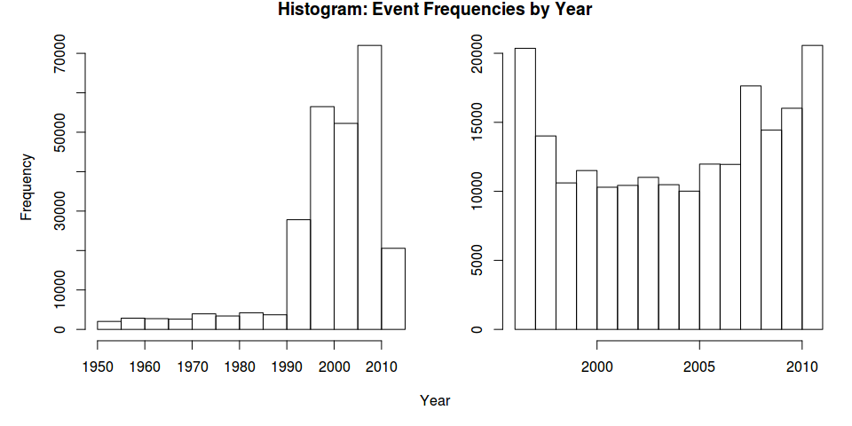

# Impact of Severe Storm Events

## Synopsis

In this report we explore the NOAA Storm Database for the effects that severe
storm weather has had to both people and property. The data comes from the
United States [National Weather Service](http://www.weather.gov/) and covers the
period from 1950 to 2011.  However, we selected only events between 1996 and
2011 as that was when a [larger range of weather events](#events) were first
being measured. We found that the greatest number of casualties (as measured by
injury or fatality) occurred during
[tornados](#what-events-had-the-most-casualties). We also found that the
greatest economic cost occurred as a consequence of
[floods](#what-events-had-the-greatest-economic-cost).

## Data Processing

Storm Data begins in 1950 and ends in November 2011. The following sections will
read and process [Storm Data](#data) to obtain casualty and economic damage 
measurements. As this anaylsis is only looking at the most severe impacts of
weather events we have made a number of simplifying assumptions:

* we are looking at the entire USA and not focused on location specifics of 
state, county or marine region

* the weather [events](#events) types are messy and will only be minimally
modified to highlight the events of greatest impact


```r
# set our runtime environment and global defaults.
require(knitr, quietly = TRUE)
require(utils, quietly = TRUE)
require(stringr, quietly = TRUE)
require(dplyr, quietly = TRUE)
require(reshape2, quietly = TRUE)
require(ggplot2, quietly = TRUE)
require(scales, quietly = TRUE)
opts_chunk$set(echo = TRUE, cache = TRUE, cache.path = "cache/", 
               fig.width = 10, fig.height = 7, fig.path = "figure/")
```

### Download Storm Data

Download and load [Storm Data](#data) which is a `bzip2` archive containing a
storm data `CSV` records.


```r
# download archive into local directory
archiveName <- file.path("stormdata.csv.bz2")
if (!file.exists(archiveName)) {
    archiveUrl <- "https://d396qusza40orc.cloudfront.net/repdata%2Fdata%2FStormData.csv.bz2"
    download.file(archiveUrl, destfile = archiveName, method = "curl", mode = "wb")
    print(paste(Sys.time(), "archive downloaded"))
}
if(!exists("stormdata")) {
    stormdata <- read.csv(archiveName, stringsAsFactors = FALSE)
}
```

### Subset Storm Data

Subset data for the columns required for analysis of casualties and damages. Not
all fields contained in the dataset are relevant for this exploration.

The column names were set to lowercase and cast to appropriate classes.


```r
# only need a subset of fields from storm data for this analysis
data <- stormdata[, c("EVTYPE", "BGN_DATE", "FATALITIES", "INJURIES",
                      "PROPDMG", "PROPDMGEXP", "CROPDMG", "CROPDMGEXP")]

# cleanup and lowercase column names
names(data) <- tolower(names(data))
names(data) <- gsub("_", "", names(data))

# convert string to date
data <- transform(data, bgndate = as.Date(bgndate, format= "%m/%d/%Y 0:00:00", tz = "C"))

# remove records where no casualties and damages have been recorded
data <- data %>% filter(!(fatalities == 0 & injuries == 0 & propdmg == 0 & cropdmg == 0))
```

### Date

From 1950 to 1995 only Tornado, Thunderstorm Wind and Hail weather events were
being recorded. Then in 1996 the [NWS Directive 
10-1605](http://www.ncdc.noaa.gov/stormevents/pd01016005curr.pdf) introduced 48 
standardised event types. So this analysis will use data from 1996 to 2011.


```r
# plot combined histogram of events before and after
data <- transform(data, year = strtoi(format(data$bgndate, "%Y")))

# show change in event frequency if we remove all invalid event types
par(mfrow = c(1, 2), mar = c(3, 4, 1, 1), oma = c(2, 1, 1, 0))

# histogram of events 1950 to 2011
hist(data$year, main = "", xlab = "")

# use data from 1996
data <- data %>% filter(year >= 1996)

# histogram of events from 1996 to 2011
hist(data$year, main = "", ylab = "", xlab = "")
title(main = "Histogram: Event Frequencies by Year", outer = TRUE)
mtext("Year", side = 1, outer = TRUE)
```

 

So, restricting to 1996 onwards will give us a more even spread of events to
analyse.

### Damage Exponents

The property and crop damage exponents are documented in Section 2.7 "Damage",
[National Weather Service Storm Data
Documentation](https://d396qusza40orc.cloudfront.net/repdata%2Fpeer2_doc%2Fpd01016005curr.pdf)

They are: **K** for thousands ($10^3$), **M** for millions ($10^6$), **B** for
billions ($10^9$).

The following will map `propdmgexp` and `cropdmgexp` from a character to the 
associated numeric value. We will then update the property (`propdmg`) and crop 
(`cropdmg`) damage estimates using these converted exponents.


```r
# convert damage exponents to associated numerics
# where strtoi() will convert "" to 0
data$propdmgexp <- strtoi(chartr("KMB", "369", data$propdmgexp))
data$cropdmgexp <- strtoi(chartr("KMB", "369", data$cropdmgexp))

# update damage using translated exponents, where 10^0 = 1 (i.e. no change)
options(scipen = 20)
data$propdmg <- data$propdmg * 10^data$propdmgexp
data$cropdmg <- data$cropdmg * 10^data$cropdmgexp

# cleanup
data$propdmgexp <- NULL
data$cropdmgexp <- NULL
```

### Events

But, what of the event types?

There are several issues with this Storm Data. Obvious event types have been 
matched to standard event types:

* event types - there are more [event
  types](http://www.ncdc.noaa.gov/stormevents/details.jsp?type=eventtype) than
  the offical list
* provenance - data with multiple sources that have not been guarenteed by the
  NWS

As per NWS Directive 10-1605 there are only 48 valid event types as listed in 
[Table 1, Section 2.1.1 "Storm Data Event Table", National Weather Service Storm
Data Documentation](#documentation). See also [Event Types 
Available](http://www.ncdc.noaa.gov/stormevents/details.jsp?type=eventtype). 

Furthermore, there are multiple sources have not been guarenteed by the NWS,
which state:

_Some information appearing in Storm Data may be provided by or gathered from 
sources outside the National Weather Service (NWS), such as the media, law 
enforcement and/or other government agencies, private companies, individuals, 
etc. An effort is made to use the best available information, but because of 
time and resource constraints, information from these sources may be unverified 
by the NWS. Accordingly, the NWS does not guarantee the accuracy or validity of 
the information._

Source: Section 1 "Storm Data Disclaimer", [National Weather Service Storm Data 
Documentation](https://d396qusza40orc.cloudfront.net/repdata%2Fpeer2_doc%2Fpd01016005curr.pdf)

How bad is the event types?


```r
# trim and uppercase to standardise what we are looking at
data <- transform(data, evtype = toupper(str_trim(evtype, side = "both")))

# what do we have?
unique(data$evtype)
```

```
##   [1] "WINTER STORM"              "TORNADO"                  
##   [3] "TSTM WIND"                 "HIGH WIND"                
##   [5] "FLASH FLOOD"               "FREEZING RAIN"            
##   [7] "EXTREME COLD"              "LIGHTNING"                
##   [9] "HAIL"                      "FLOOD"                    
##  [11] "TSTM WIND/HAIL"            "EXCESSIVE HEAT"           
##  [13] "RIP CURRENTS"              "OTHER"                    
##  [15] "HEAVY SNOW"                "WILD/FOREST FIRE"         
##  [17] "ICE STORM"                 "BLIZZARD"                 
##  [19] "STORM SURGE"               "ICE JAM FLOOD (MINOR"     
##  [21] "DUST STORM"                "STRONG WIND"              
##  [23] "DUST DEVIL"                "URBAN/SML STREAM FLD"     
##  [25] "FOG"                       "ROUGH SURF"               
##  [27] "HEAVY SURF"                "HEAVY RAIN"               
##  [29] "MARINE ACCIDENT"           "AVALANCHE"                
##  [31] "FREEZE"                    "DRY MICROBURST"           
##  [33] "WINDS"                     "COASTAL STORM"            
##  [35] "EROSION/CSTL FLOOD"        "RIVER FLOODING"           
##  [37] "WATERSPOUT"                "DAMAGING FREEZE"          
##  [39] "HURRICANE"                 "TROPICAL STORM"           
##  [41] "BEACH EROSION"             "HIGH SURF"                
##  [43] "HEAVY RAIN/HIGH SURF"      "UNSEASONABLE COLD"        
##  [45] "EARLY FROST"               "WINTRY MIX"               
##  [47] "DROUGHT"                   "COASTAL FLOODING"         
##  [49] "TORRENTIAL RAINFALL"       "LANDSLUMP"                
##  [51] "HURRICANE EDOUARD"         "TIDAL FLOODING"           
##  [53] "STRONG WINDS"              "EXTREME WINDCHILL"        
##  [55] "GLAZE"                     "EXTENDED COLD"            
##  [57] "WHIRLWIND"                 "HEAVY SNOW SHOWER"        
##  [59] "LIGHT SNOW"                "COASTAL FLOOD"            
##  [61] "MIXED PRECIP"              "COLD"                     
##  [63] "FREEZING SPRAY"            "DOWNBURST"                
##  [65] "MUDSLIDES"                 "MICROBURST"               
##  [67] "MUDSLIDE"                  "SNOW"                     
##  [69] "SNOW SQUALLS"              "WIND DAMAGE"              
##  [71] "LIGHT SNOWFALL"            "FREEZING DRIZZLE"         
##  [73] "GUSTY WIND/RAIN"           "GUSTY WIND/HVY RAIN"      
##  [75] "WIND"                      "COLD TEMPERATURE"         
##  [77] "HEAT WAVE"                 "COLD AND SNOW"            
##  [79] "RAIN/SNOW"                 "TSTM WIND (G45)"          
##  [81] "GUSTY WINDS"               "GUSTY WIND"               
##  [83] "TSTM WIND 40"              "TSTM WIND 45"             
##  [85] "HARD FREEZE"               "TSTM WIND (41)"           
##  [87] "HEAT"                      "RIVER FLOOD"              
##  [89] "TSTM WIND (G40)"           "RIP CURRENT"              
##  [91] "MUD SLIDE"                 "FROST/FREEZE"             
##  [93] "SNOW AND ICE"              "AGRICULTURAL FREEZE"      
##  [95] "WINTER WEATHER"            "SNOW SQUALL"              
##  [97] "ICY ROADS"                 "THUNDERSTORM"             
##  [99] "HYPOTHERMIA/EXPOSURE"      "LAKE EFFECT SNOW"         
## [101] "MIXED PRECIPITATION"       "BLACK ICE"                
## [103] "COASTALSTORM"              "DAM BREAK"                
## [105] "BLOWING SNOW"              "FROST"                    
## [107] "GRADIENT WIND"             "UNSEASONABLY COLD"        
## [109] "TSTM WIND AND LIGHTNING"   "WET MICROBURST"           
## [111] "HEAVY SURF AND WIND"       "FUNNEL CLOUD"             
## [113] "TYPHOON"                   "LANDSLIDES"               
## [115] "HIGH SWELLS"               "HIGH WINDS"               
## [117] "SMALL HAIL"                "UNSEASONAL RAIN"          
## [119] "COASTAL FLOODING/EROSION"  "TSTM WIND  (G45)"         
## [121] "HIGH WIND (G40)"           "TSTM WIND (G35)"          
## [123] "COASTAL EROSION"           "UNSEASONABLY WARM"        
## [125] "SEICHE"                    "COASTAL  FLOODING/EROSION"
## [127] "HYPERTHERMIA/EXPOSURE"     "ROCK SLIDE"               
## [129] "GUSTY WIND/HAIL"           "HEAVY SEAS"               
## [131] "LANDSPOUT"                 "RECORD HEAT"              
## [133] "EXCESSIVE SNOW"            "FLOOD/FLASH/FLOOD"        
## [135] "WIND AND WAVE"             "FLASH FLOOD/FLOOD"        
## [137] "LIGHT FREEZING RAIN"       "ICE ROADS"                
## [139] "HIGH SEAS"                 "RAIN"                     
## [141] "ROUGH SEAS"                "TSTM WIND G45"            
## [143] "NON-SEVERE WIND DAMAGE"    "WARM WEATHER"             
## [145] "THUNDERSTORM WIND (G40)"   "LANDSLIDE"                
## [147] "HIGH WATER"                "LATE SEASON SNOW"         
## [149] "WINTER WEATHER MIX"        "ROGUE WAVE"               
## [151] "FALLING SNOW/ICE"          "NON-TSTM WIND"            
## [153] "NON TSTM WIND"             "BRUSH FIRE"               
## [155] "BLOWING DUST"              "VOLCANIC ASH"             
## [157] "HIGH SURF ADVISORY"        "HAZARDOUS SURF"           
## [159] "WILDFIRE"                  "COLD WEATHER"             
## [161] "ICE ON ROAD"               "DROWNING"                 
## [163] "EXTREME COLD/WIND CHILL"   "MARINE TSTM WIND"         
## [165] "HURRICANE/TYPHOON"         "DENSE FOG"                
## [167] "WINTER WEATHER/MIX"        "ASTRONOMICAL HIGH TIDE"   
## [169] "HEAVY SURF/HIGH SURF"      "TROPICAL DEPRESSION"      
## [171] "LAKE-EFFECT SNOW"          "MARINE HIGH WIND"         
## [173] "THUNDERSTORM WIND"         "TSUNAMI"                  
## [175] "STORM SURGE/TIDE"          "COLD/WIND CHILL"          
## [177] "LAKESHORE FLOOD"           "MARINE THUNDERSTORM WIND" 
## [179] "MARINE STRONG WIND"        "ASTRONOMICAL LOW TIDE"    
## [181] "DENSE SMOKE"               "MARINE HAIL"              
## [183] "FREEZING FOG"
```

```r
# how many do we have
evcount <- length(unique(data$evtype))
```

In our subset we have ``183`` distinct event types, which is a lot to
clean-up. So, lets look at just those that have the largest impact as measured 
by number of occurrences:


```r
# lets focus events with the most damages and casualties
totals <- data %>%
    mutate(totcas = fatalities + injuries) %>%
    mutate(totdmg = propdmg + cropdmg) %>%
    select(evtype, totcas, totdmg) %>%
    group_by(evtype) %>%
    summarise(totcas = sum(totcas), totdmg = sum(totdmg))

# what are the major events
head(totals %>% arrange(desc(totcas)) %>% select(evtype, totcas), 20)
```

```
## Source: local data frame [20 x 2]
## 
##               evtype totcas
## 1            TORNADO  22178
## 2     EXCESSIVE HEAT   8188
## 3              FLOOD   7172
## 4          LIGHTNING   4792
## 5          TSTM WIND   3870
## 6        FLASH FLOOD   2561
## 7  THUNDERSTORM WIND   1530
## 8       WINTER STORM   1483
## 9               HEAT   1459
## 10 HURRICANE/TYPHOON   1339
## 11         HIGH WIND   1318
## 12          WILDFIRE    986
## 13        HEAVY SNOW    805
## 14               FOG    772
## 15              HAIL    720
## 16  WILD/FOREST FIRE    557
## 17       RIP CURRENT    549
## 18      RIP CURRENTS    496
## 19          BLIZZARD    455
## 20         ICE STORM    400
```

```r
head(totals %>% arrange(desc(totdmg)) %>% select(evtype, totdmg), 20)
```

```
## Source: local data frame [20 x 2]
## 
##               evtype       totdmg
## 1              FLOOD 148919611950
## 2  HURRICANE/TYPHOON  71913712800
## 3        STORM SURGE  43193541000
## 4            TORNADO  24900370720
## 5               HAIL  17071172870
## 6        FLASH FLOOD  16557155610
## 7          HURRICANE  14554229010
## 8            DROUGHT  14413667000
## 9     TROPICAL STORM   8320186550
## 10         HIGH WIND   5881421660
## 11          WILDFIRE   5054139800
## 12         TSTM WIND   5040071790
## 13  STORM SURGE/TIDE   4642038000
## 14 THUNDERSTORM WIND   3780985440
## 15         ICE STORM   3657908810
## 16  WILD/FOREST FIRE   3108564830
## 17      WINTER STORM   1544687250
## 18      EXTREME COLD   1328733400
## 19        HEAVY RAIN   1313034240
## 20      FROST/FREEZE   1104666000
```

From these lists we can see some obvious changes that will fix spelling some 
abbreviations and extraneous codes. Lets apply some and map them to the known 48
approved types:


```r
# map to a real event type
data <- transform(data, evtype = gsub("TSTM", "THUNDERSTORM", evtype))
data <- transform(data, evtype = gsub("^THUNDERSTORM.*", "THUNDERSTORM WIND", evtype))
data <- transform(data, evtype = gsub("HURRICANE.*", "HURRICANE (TYPHOON)", evtype))
data <- transform(data, evtype = gsub("^TYPHOON", "HURRICANE (TYPHOON)", evtype))
data <- transform(data, evtype = gsub("STORM SURGE.*", "STORM SURGE/TIDE", evtype))
data <- transform(data, evtype = gsub("CSTL", "COASTAL", evtype))
data <- transform(data, evtype = gsub("EXTREME COLD.*", "EXTREME COLD/WIND CHILL", evtype))
data <- transform(data, evtype = gsub("TIDAL FLOODING", "COASTAL FLOOD", evtype))
data <- transform(data, evtype = gsub(".*COASTAL FLOOD.*", "COASTAL FLOOD", evtype))
data <- transform(data, evtype = gsub("COASTALSTORM", "COASTAL STORM", evtype))
data <- transform(data, evtype = gsub("RIVER FLOOD.*", "FLOOD", evtype))
data <- transform(data, evtype = gsub("ICE JAM FLOOD.*", "FLOOD", evtype))
data <- transform(data, evtype = gsub(".*FLASH.FLOOD.*", "FLASH FLOOD", evtype))
data <- transform(data, evtype = gsub("GUSTY WINDS", "STRONG WIND", evtype))
data <- transform(data, evtype = gsub("NON.THUNDERSTORM WIND", "STRONG WIND", evtype))
data <- transform(data, evtype = gsub("HIGH WIND.*", "HIGH WIND", evtype))
data <- transform(data, evtype = gsub("WINDS", "WIND", evtype))
data <- transform(data, evtype = gsub("^FOG", "DENSE FOG", evtype))
data <- transform(data, evtype = gsub("AVALANCE", "AVALANCHE", evtype))
data <- transform(data, evtype = gsub("WILD.* FIRE", "WILDFIRE", evtype))
data <- transform(data, evtype = gsub("RIP CURRENTS", "RIP CURRENT", evtype))
data <- transform(data, evtype = gsub("URBAN/SML STREAM FLD", "FLASH FLOOD", evtype))
data <- transform(data, evtype = gsub("WINTRY MIX*", "WINTER WEATHER", evtype))
data <- transform(data, evtype = gsub("WINTER WEATHER.*", "WINTER WEATHER", evtype))

# show impact
totals <- data %>%
    mutate(totcas = fatalities + injuries) %>%
    mutate(totdmg = propdmg + cropdmg) %>%
    select(evtype, totcas, totdmg) %>%
    group_by(evtype) %>%
    summarise(totcas = sum(totcas), totdmg = sum(totdmg))

# what are the major events
head(totals %>% arrange(desc(totcas)) %>% select(evtype, totcas), 20)
```

```
## Source: local data frame [20 x 2]
## 
##                 evtype totcas
## 1              TORNADO  22178
## 2       EXCESSIVE HEAT   8188
## 3                FLOOD   7175
## 4    THUNDERSTORM WIND   5508
## 5            LIGHTNING   4792
## 6          FLASH FLOOD   2668
## 7             WILDFIRE   1543
## 8         WINTER STORM   1483
## 9                 HEAT   1459
## 10 HURRICANE (TYPHOON)   1453
## 11           HIGH WIND   1318
## 12         RIP CURRENT   1045
## 13           DENSE FOG    924
## 14          HEAVY SNOW    805
## 15                HAIL    720
## 16      WINTER WEATHER    622
## 17            BLIZZARD    455
## 18         STRONG WIND    424
## 19           ICE STORM    400
## 20      TROPICAL STORM    395
```

```r
head(totals %>% arrange(desc(totdmg)) %>% select(evtype, totdmg), 20)
```

```
## Source: local data frame [20 x 2]
## 
##                     evtype       totdmg
## 1                    FLOOD 149075944950
## 2      HURRICANE (TYPHOON)  87068996810
## 3         STORM SURGE/TIDE  47835579000
## 4                  TORNADO  24900370720
## 5                     HAIL  17071172870
## 6              FLASH FLOOD  16623968360
## 7                  DROUGHT  14413667000
## 8        THUNDERSTORM WIND   8930498480
## 9           TROPICAL STORM   8320186550
## 10                WILDFIRE   8162704630
## 11               HIGH WIND   5881939660
## 12               ICE STORM   3657908810
## 13            WINTER STORM   1544687250
## 14 EXTREME COLD/WIND CHILL   1337431400
## 15              HEAVY RAIN   1313034240
## 16            FROST/FREEZE   1104666000
## 17               LIGHTNING    749975520
## 18              HEAVY SNOW    705539640
## 19                BLIZZARD    532718950
## 20          EXCESSIVE HEAT    500125700
```

```r
# what do we have now?
unique(data$evtype)
```

```
##   [1] "WINTER STORM"              "TORNADO"                  
##   [3] "THUNDERSTORM WIND"         "HIGH WIND"                
##   [5] "FLASH FLOOD"               "FREEZING RAIN"            
##   [7] "EXTREME COLD/WIND CHILL"   "LIGHTNING"                
##   [9] "HAIL"                      "FLOOD"                    
##  [11] "EXCESSIVE HEAT"            "RIP CURRENT"              
##  [13] "OTHER"                     "HEAVY SNOW"               
##  [15] "WILDFIRE"                  "ICE STORM"                
##  [17] "BLIZZARD"                  "STORM SURGE/TIDE"         
##  [19] "DUST STORM"                "STRONG WIND"              
##  [21] "DUST DEVIL"                "DENSE FOG"                
##  [23] "ROUGH SURF"                "HEAVY SURF"               
##  [25] "HEAVY RAIN"                "MARINE ACCIDENT"          
##  [27] "AVALANCHE"                 "FREEZE"                   
##  [29] "DRY MICROBURST"            "WIND"                     
##  [31] "COASTAL STORM"             "COASTAL FLOOD"            
##  [33] "WATERSPOUT"                "DAMAGING FREEZE"          
##  [35] "HURRICANE (TYPHOON)"       "TROPICAL STORM"           
##  [37] "BEACH EROSION"             "HIGH SURF"                
##  [39] "HEAVY RAIN/HIGH SURF"      "UNSEASONABLE COLD"        
##  [41] "EARLY FROST"               "WINTER WEATHER"           
##  [43] "DROUGHT"                   "TORRENTIAL RAINFALL"      
##  [45] "LANDSLUMP"                 "EXTREME WINDCHILL"        
##  [47] "GLAZE"                     "EXTENDED COLD"            
##  [49] "WHIRLWIND"                 "HEAVY SNOW SHOWER"        
##  [51] "LIGHT SNOW"                "MIXED PRECIP"             
##  [53] "COLD"                      "FREEZING SPRAY"           
##  [55] "DOWNBURST"                 "MUDSLIDES"                
##  [57] "MICROBURST"                "MUDSLIDE"                 
##  [59] "SNOW"                      "SNOW SQUALLS"             
##  [61] "WIND DAMAGE"               "LIGHT SNOWFALL"           
##  [63] "FREEZING DRIZZLE"          "GUSTY WIND/RAIN"          
##  [65] "GUSTY WIND/HVY RAIN"       "COLD TEMPERATURE"         
##  [67] "HEAT WAVE"                 "COLD AND SNOW"            
##  [69] "RAIN/SNOW"                 "GUSTY WIND"               
##  [71] "HARD FREEZE"               "HEAT"                     
##  [73] "MUD SLIDE"                 "FROST/FREEZE"             
##  [75] "SNOW AND ICE"              "AGRICULTURAL FREEZE"      
##  [77] "SNOW SQUALL"               "ICY ROADS"                
##  [79] "HYPOTHERMIA/EXPOSURE"      "LAKE EFFECT SNOW"         
##  [81] "MIXED PRECIPITATION"       "BLACK ICE"                
##  [83] "DAM BREAK"                 "BLOWING SNOW"             
##  [85] "FROST"                     "GRADIENT WIND"            
##  [87] "UNSEASONABLY COLD"         "WET MICROBURST"           
##  [89] "HEAVY SURF AND WIND"       "FUNNEL CLOUD"             
##  [91] "LANDSLIDES"                "HIGH SWELLS"              
##  [93] "SMALL HAIL"                "UNSEASONAL RAIN"          
##  [95] "COASTAL EROSION"           "UNSEASONABLY WARM"        
##  [97] "SEICHE"                    "COASTAL  FLOODING/EROSION"
##  [99] "HYPERTHERMIA/EXPOSURE"     "ROCK SLIDE"               
## [101] "GUSTY WIND/HAIL"           "HEAVY SEAS"               
## [103] "LANDSPOUT"                 "RECORD HEAT"              
## [105] "EXCESSIVE SNOW"            "WIND AND WAVE"            
## [107] "LIGHT FREEZING RAIN"       "ICE ROADS"                
## [109] "HIGH SEAS"                 "RAIN"                     
## [111] "ROUGH SEAS"                "NON-SEVERE WIND DAMAGE"   
## [113] "WARM WEATHER"              "LANDSLIDE"                
## [115] "HIGH WATER"                "LATE SEASON SNOW"         
## [117] "ROGUE WAVE"                "FALLING SNOW/ICE"         
## [119] "BRUSH FIRE"                "BLOWING DUST"             
## [121] "VOLCANIC ASH"              "HIGH SURF ADVISORY"       
## [123] "HAZARDOUS SURF"            "COLD WEATHER"             
## [125] "ICE ON ROAD"               "DROWNING"                 
## [127] "MARINE THUNDERSTORM WIND"  "ASTRONOMICAL HIGH TIDE"   
## [129] "HEAVY SURF/HIGH SURF"      "TROPICAL DEPRESSION"      
## [131] "LAKE-EFFECT SNOW"          "MARINE HIGH WIND"         
## [133] "TSUNAMI"                   "COLD/WIND CHILL"          
## [135] "LAKESHORE FLOOD"           "MARINE STRONG WIND"       
## [137] "ASTRONOMICAL LOW TIDE"     "DENSE SMOKE"              
## [139] "MARINE HAIL"               "FREEZING FOG"
```

We can always add more but this seems a good start, addressing some of the more 
obvious events that have the most impact. The important thing is that the top 20
now are in out approved list of events and we have not made too many assumptions
about event categories.


```r
# use title-case for pretty reports
data <- transform(data, evtype = str_to_title(str_trim(evtype)))
```

### Casualties

Prepare a data frame of total casualties, (composed of fatalties and injuries).
The report will list weather events in descending order of total casualties.


```r
# summarise by event type, and total is used to order results
casualty <- data %>%
    mutate(total = fatalities + injuries) %>%
    filter(total > 0) %>%
    select(evtype, total, fatalities, injuries) %>%
    group_by(evtype) %>%
    summarise(total = sum(total), fatalities = sum(fatalities), injuries = sum(injuries))

# melt into long format to help with plotting
casualty <- melt(casualty, id.vars = c("evtype", "total"), variable.name = "casualties")
casualty <- transform(casualty, casualties = factor(casualties))
```

### Economic Damages

Prepare a data frame of total damages, (composed of crop and property damage
estimates in USD). The report will list event types in descending order of total
damages.


```r
# summarise by event type, and total is used to order results
damage <- data %>%
    mutate(total = propdmg + cropdmg) %>%
    filter(total > 0) %>%
    select(evtype, total, propdmg, cropdmg) %>%
    group_by(evtype) %>%
    summarise(total = sum(total), property = sum(propdmg), crop = sum(cropdmg))

# melt into long format to help with plotting
damage <- melt(damage, id.vars = c("evtype", "total"), variable.name = "damages")
damage <- transform(damage, damages = factor(damages))
```

## Results

Looking at the results, it is clear that some attention could be made to address
the  messy [event types](#events), but this is unlikely to effect the ranking if
the most severe.

### What events had the most casualties?

The total number of casualties (fatalities and injuries) were counted from 1996 
to 2011. Total casualties were then sorted in descending order. The top events
that cause the greatest loss of life or injury are:


```r
# order by most severe events
casualty <- arrange(casualty, desc(total))

# show n = 20  events by casualty in descending order (first 2*n rows since long format)
casualty[1:(2*20),] %>%
    ggplot(aes(x = reorder(evtype, total), y = value/1000, fill = casualties)) +
    geom_bar(stat = "identity", position = "stack") +
    coord_flip() +
    theme_light(base_family = "sans", base_size = 11) +
    theme(legend.justification = c(1, 0), legend.position = c(1, 0)) +
    scale_fill_brewer(name = "Casualty", palette = "Set2") +
    scale_x_discrete(name = "Weather Event") +
    scale_y_discrete(name = "Casualties (thousands)", breaks = pretty_breaks(n = 10)) +
    ggtitle("United States: Casualties from Severe Storm Weather (1996-2011)")
```

 

### What events had the greatest economic cost? 

All Crop and property damage estimates were summed from 1996 to 2011. Total 
costs were then sorted in descending order. The top events that incur the 
greatest economic cost are:


```r
# order by most severe events
damage <- arrange(damage, desc(total))

# show n = 20 events by damages in descending order (first 2*n rows since long format)
damage[1:(2*20),] %>%
    ggplot(aes(x = reorder(evtype, total), y = value/10^9, fill = damages)) +
    geom_bar(stat = "identity", position = "stack") +
    coord_flip() +
    theme_light(base_family = "sans", base_size = 11) +
    theme(legend.justification = c(1, 0), legend.position = c(1, 0)) +
    scale_fill_brewer(name = "Damage", palette = "Set2") +
    scale_x_discrete(name = "Weather Event") +
    scale_y_continuous(name = "Damages (estimate in USD Billions)", breaks = pretty_breaks(n = 10)) +
    ggtitle("United States: Economic Damages from Severe Storm Weather (1996-2011)")
```

 

## Appendices

### 

### Data

* [Storm Data](https://d396qusza40orc.cloudfront.net/repdata%2Fdata%2FStormData.csv.bz2)
[47Mb] 

### Code

* all code and associated documentation is available on GitHub from [here](https://github.com/frankhjung/repdata-project2).

### Documentation

* National Weather Service [Storm Data Documentation](https://d396qusza40orc.cloudfront.net/repdata%2Fpeer2_doc%2Fpd01016005curr.pdf)

* National Climatic Data Center Storm Events
[FAQ](https://d396qusza40orc.cloudfront.net/repdata%2Fpeer2_doc%2FNCDC%20Storm%20Events-FAQ%20Page.pdf)

### Session Information

This document was produced in RStudio. The session information detailing
packages used is:


```r
sessionInfo()
```

```
## R version 3.2.0 (2015-04-16)
## Platform: x86_64-pc-linux-gnu (64-bit)
## Running under: Linux Mint LMDE
## 
## locale:
##  [1] LC_CTYPE=en_AU.UTF-8       LC_NUMERIC=C              
##  [3] LC_TIME=en_AU.UTF-8        LC_COLLATE=en_AU.UTF-8    
##  [5] LC_MONETARY=en_AU.UTF-8    LC_MESSAGES=en_AU.UTF-8   
##  [7] LC_PAPER=en_AU.UTF-8       LC_NAME=C                 
##  [9] LC_ADDRESS=C               LC_TELEPHONE=C            
## [11] LC_MEASUREMENT=en_AU.UTF-8 LC_IDENTIFICATION=C       
## 
## attached base packages:
## [1] stats     graphics  grDevices utils     datasets  methods   base     
## 
## other attached packages:
## [1] scales_0.2.5   ggplot2_1.0.1  reshape2_1.4.1 dplyr_0.4.1   
## [5] stringr_1.0.0  knitr_1.10.5  
## 
## loaded via a namespace (and not attached):
##  [1] Rcpp_0.11.6        magrittr_1.5       MASS_7.3-40       
##  [4] munsell_0.4.2      colorspace_1.2-6   plyr_1.8.3        
##  [7] tools_3.2.0        parallel_3.2.0     grid_3.2.0        
## [10] gtable_0.1.2       DBI_0.3.1          htmltools_0.2.6   
## [13] yaml_2.1.13        lazyeval_0.1.10    assertthat_0.1    
## [16] digest_0.6.8       RColorBrewer_1.1-2 formatR_1.2       
## [19] codetools_0.2-11   evaluate_0.7       rmarkdown_0.7     
## [22] stringi_0.4-1      proto_0.3-10
```
