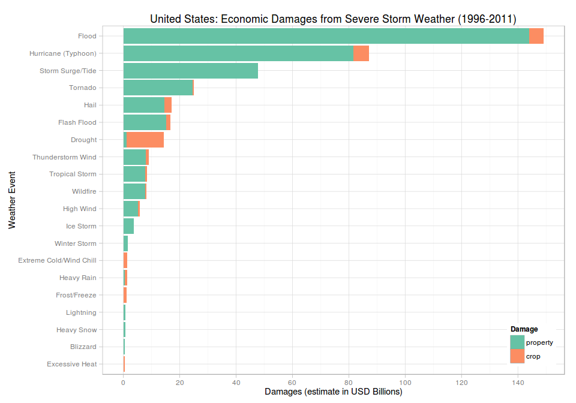

# Impact of Severe Storm Events

## Synopsis

In this report we explore the NOAA Storm Database for the effects that severe
storm weather has had to both people and property. The data comes from the
United States [National Weather Service](http://www.weather.gov/) and covers the
period from 1950 to 2011.  However, we selected only events between 1996 and
2011 as that was when a [larger range of weather events](#events) were first
being measured. We found that the greatest number of casualties (as measured by
injury or fatality) occurred during
[tornados](#what-events-had-the-most-casualties). We also found that the
greatest economic cost occurred as a consequence of
[floods](#what-events-had-the-greatest-economic-cost).

## Data Processing

Storm Data begins in 1950 and ends in November 2011. The following sections will
read and process [Storm Data](#data) to obtain casualty and economic damage 
measurements. As this anaylsis is only looking at the most severe impacts of
weather events we have made a number of simplifying assumptions:

* we are looking at the entire USA and not focused on location specifics of 
state, county or marine region

* the weather [events](#events) types are messy and will only be minimally
modified to highlight the events of greatest impact


```r
# set our runtime environment and global defaults.
require(knitr, quietly = TRUE)
require(utils, quietly = TRUE)
require(stringr, quietly = TRUE)
require(dplyr, quietly = TRUE)
require(reshape2, quietly = TRUE)
require(ggplot2, quietly = TRUE)
require(scales, quietly = TRUE)
opts_chunk$set(echo = TRUE, cache = TRUE, cache.path = "cache/", 
               fig.width = 10, fig.height = 7, fig.path = "figure/")
```

### Download Storm Data

Download and load [Storm Data](#data) which is a `bzip2` archive containing a
storm data `CSV` records.


```r
# download archive into local directory
archiveName <- file.path("stormdata.csv.bz2")
if (!file.exists(archiveName)) {
    archiveUrl <- "https://d396qusza40orc.cloudfront.net/repdata%2Fdata%2FStormData.csv.bz2"
    download.file(archiveUrl, destfile = archiveName, method = "curl", mode = "wb")
    print(paste(Sys.time(), "archive downloaded"))
}
if(!exists("stormdata")) {
    stormdata <- read.csv(archiveName, stringsAsFactors = FALSE)
}
```

### Subset Storm Data

Subset data for the columns required for analysis of casualties and damages. Not
all fields contained in the dataset are relevant for this exploration.

The column names were set to lowercase and cast to appropriate classes.


```r
# only need a subset of fields from storm data for this analysis
data <- stormdata[, c("EVTYPE", "BGN_DATE", "FATALITIES", "INJURIES",
                      "PROPDMG", "PROPDMGEXP", "CROPDMG", "CROPDMGEXP")]

# cleanup and lowercase column names
names(data) <- tolower(names(data))
names(data) <- gsub("_", "", names(data))

# convert string to date
data <- transform(data, bgndate = as.Date(bgndate, format= "%m/%d/%Y 0:00:00", tz = "C"))

# remove records where no casualties and damages have been recorded
data <- data %>% filter(!(fatalities == 0 & injuries == 0 & propdmg == 0 & cropdmg == 0))
```

### Effective Date

From 1950 to 1995 only Tornado, Thunderstorm Wind and Hail weather events were
being recorded. Then in 1996 the [NWS Directive 
10-1605](http://www.ncdc.noaa.gov/stormevents/pd01016005curr.pdf) introduced 48 
standardised event types. So this analysis will use data from 1996 to 2011.


```r
# plot combined histogram of events before and after
data <- transform(data, year = strtoi(format(data$bgndate, "%Y")))

# show change in event frequency if we remove all invalid event types
par(mfrow = c(1, 2), mar = c(3, 4, 1, 1), oma = c(2, 1, 1, 0))

# histogram of events 1950 to 2011
hist(data$year, main = "", xlab = "")

# use data from 1996
data <- data %>% filter(year >= 1996)

# histogram of events from 1996 to 2011
hist(data$year, main = "", ylab = "", xlab = "")
title(main = "Histogram: Event Frequencies by Year", outer = TRUE)
mtext("Year", side = 1, outer = TRUE)
```

 

So, restricting to 1996 onwards will give us a more even spread of events to
analyse.

### Damage Exponents

The property and crop damage exponents are documented in Section 2.7 "Damage",
[National Weather Service Storm Data
Documentation](https://d396qusza40orc.cloudfront.net/repdata%2Fpeer2_doc%2Fpd01016005curr.pdf)

They are: **K** for thousands ($10^3$), **M** for millions ($10^6$), **B** for
billions ($10^9$).

The following will map `propdmgexp` and `cropdmgexp` from a character to the 
associated numeric value. We will then update the property (`propdmg`) and crop 
(`cropdmg`) damage estimates using these converted exponents.


```r
# convert damage exponents to associated numerics
# where strtoi() will convert "" to 0
data$propdmgexp <- strtoi(chartr("KMB", "369", data$propdmgexp))
data$cropdmgexp <- strtoi(chartr("KMB", "369", data$cropdmgexp))

# update damage using translated exponents, where 10^0 = 1 (i.e. no change)
options(scipen = 20)
data$propdmg <- data$propdmg * 10^data$propdmgexp
data$cropdmg <- data$cropdmg * 10^data$cropdmgexp

# cleanup
data$propdmgexp <- NULL
data$cropdmgexp <- NULL
```

### Events

There are several issues with [event 
types](http://www.ncdc.noaa.gov/stormevents/details.jsp?type=eventtype) in this 
Storm data. As per NWS Directive 10-1605 there are only 48 valid event types as
listed in [Table 1, Section 2.1.1 "Storm Data Event Table", National Weather
Service Storm Data Documentation](#documentation). See also [Event Types 
Available](http://www.ncdc.noaa.gov/stormevents/details.jsp?type=eventtype).

How many event types do we have here?


```r
# trim and uppercase to standardise what we are looking at
data <- transform(data, evtype = toupper(str_trim(evtype, side = "both")))

# what do we have?
sort(unique(data$evtype))
```

```
##   [1] "AGRICULTURAL FREEZE"       "ASTRONOMICAL HIGH TIDE"   
##   [3] "ASTRONOMICAL LOW TIDE"     "AVALANCHE"                
##   [5] "BEACH EROSION"             "BLACK ICE"                
##   [7] "BLIZZARD"                  "BLOWING DUST"             
##   [9] "BLOWING SNOW"              "BRUSH FIRE"               
##  [11] "COASTAL EROSION"           "COASTAL FLOOD"            
##  [13] "COASTAL FLOODING"          "COASTAL  FLOODING/EROSION"
##  [15] "COASTAL FLOODING/EROSION"  "COASTALSTORM"             
##  [17] "COASTAL STORM"             "COLD"                     
##  [19] "COLD AND SNOW"             "COLD TEMPERATURE"         
##  [21] "COLD WEATHER"              "COLD/WIND CHILL"          
##  [23] "DAMAGING FREEZE"           "DAM BREAK"                
##  [25] "DENSE FOG"                 "DENSE SMOKE"              
##  [27] "DOWNBURST"                 "DROUGHT"                  
##  [29] "DROWNING"                  "DRY MICROBURST"           
##  [31] "DUST DEVIL"                "DUST STORM"               
##  [33] "EARLY FROST"               "EROSION/CSTL FLOOD"       
##  [35] "EXCESSIVE HEAT"            "EXCESSIVE SNOW"           
##  [37] "EXTENDED COLD"             "EXTREME COLD"             
##  [39] "EXTREME COLD/WIND CHILL"   "EXTREME WINDCHILL"        
##  [41] "FALLING SNOW/ICE"          "FLASH FLOOD"              
##  [43] "FLASH FLOOD/FLOOD"         "FLOOD"                    
##  [45] "FLOOD/FLASH/FLOOD"         "FOG"                      
##  [47] "FREEZE"                    "FREEZING DRIZZLE"         
##  [49] "FREEZING FOG"              "FREEZING RAIN"            
##  [51] "FREEZING SPRAY"            "FROST"                    
##  [53] "FROST/FREEZE"              "FUNNEL CLOUD"             
##  [55] "GLAZE"                     "GRADIENT WIND"            
##  [57] "GUSTY WIND"                "GUSTY WIND/HAIL"          
##  [59] "GUSTY WIND/HVY RAIN"       "GUSTY WIND/RAIN"          
##  [61] "GUSTY WINDS"               "HAIL"                     
##  [63] "HARD FREEZE"               "HAZARDOUS SURF"           
##  [65] "HEAT"                      "HEAT WAVE"                
##  [67] "HEAVY RAIN"                "HEAVY RAIN/HIGH SURF"     
##  [69] "HEAVY SEAS"                "HEAVY SNOW"               
##  [71] "HEAVY SNOW SHOWER"         "HEAVY SURF"               
##  [73] "HEAVY SURF AND WIND"       "HEAVY SURF/HIGH SURF"     
##  [75] "HIGH SEAS"                 "HIGH SURF"                
##  [77] "HIGH SURF ADVISORY"        "HIGH SWELLS"              
##  [79] "HIGH WATER"                "HIGH WIND"                
##  [81] "HIGH WIND (G40)"           "HIGH WINDS"               
##  [83] "HURRICANE"                 "HURRICANE EDOUARD"        
##  [85] "HURRICANE/TYPHOON"         "HYPERTHERMIA/EXPOSURE"    
##  [87] "HYPOTHERMIA/EXPOSURE"      "ICE JAM FLOOD (MINOR"     
##  [89] "ICE ON ROAD"               "ICE ROADS"                
##  [91] "ICE STORM"                 "ICY ROADS"                
##  [93] "LAKE EFFECT SNOW"          "LAKE-EFFECT SNOW"         
##  [95] "LAKESHORE FLOOD"           "LANDSLIDE"                
##  [97] "LANDSLIDES"                "LANDSLUMP"                
##  [99] "LANDSPOUT"                 "LATE SEASON SNOW"         
## [101] "LIGHT FREEZING RAIN"       "LIGHTNING"                
## [103] "LIGHT SNOW"                "LIGHT SNOWFALL"           
## [105] "MARINE ACCIDENT"           "MARINE HAIL"              
## [107] "MARINE HIGH WIND"          "MARINE STRONG WIND"       
## [109] "MARINE THUNDERSTORM WIND"  "MARINE TSTM WIND"         
## [111] "MICROBURST"                "MIXED PRECIP"             
## [113] "MIXED PRECIPITATION"       "MUDSLIDE"                 
## [115] "MUD SLIDE"                 "MUDSLIDES"                
## [117] "NON-SEVERE WIND DAMAGE"    "NON TSTM WIND"            
## [119] "NON-TSTM WIND"             "OTHER"                    
## [121] "RAIN"                      "RAIN/SNOW"                
## [123] "RECORD HEAT"               "RIP CURRENT"              
## [125] "RIP CURRENTS"              "RIVER FLOOD"              
## [127] "RIVER FLOODING"            "ROCK SLIDE"               
## [129] "ROGUE WAVE"                "ROUGH SEAS"               
## [131] "ROUGH SURF"                "SEICHE"                   
## [133] "SMALL HAIL"                "SNOW"                     
## [135] "SNOW AND ICE"              "SNOW SQUALL"              
## [137] "SNOW SQUALLS"              "STORM SURGE"              
## [139] "STORM SURGE/TIDE"          "STRONG WIND"              
## [141] "STRONG WINDS"              "THUNDERSTORM"             
## [143] "THUNDERSTORM WIND"         "THUNDERSTORM WIND (G40)"  
## [145] "TIDAL FLOODING"            "TORNADO"                  
## [147] "TORRENTIAL RAINFALL"       "TROPICAL DEPRESSION"      
## [149] "TROPICAL STORM"            "TSTM WIND"                
## [151] "TSTM WIND 40"              "TSTM WIND (41)"           
## [153] "TSTM WIND 45"              "TSTM WIND AND LIGHTNING"  
## [155] "TSTM WIND (G35)"           "TSTM WIND (G40)"          
## [157] "TSTM WIND G45"             "TSTM WIND  (G45)"         
## [159] "TSTM WIND (G45)"           "TSTM WIND/HAIL"           
## [161] "TSUNAMI"                   "TYPHOON"                  
## [163] "UNSEASONABLE COLD"         "UNSEASONABLY COLD"        
## [165] "UNSEASONABLY WARM"         "UNSEASONAL RAIN"          
## [167] "URBAN/SML STREAM FLD"      "VOLCANIC ASH"             
## [169] "WARM WEATHER"              "WATERSPOUT"               
## [171] "WET MICROBURST"            "WHIRLWIND"                
## [173] "WILDFIRE"                  "WILD/FOREST FIRE"         
## [175] "WIND"                      "WIND AND WAVE"            
## [177] "WIND DAMAGE"               "WINDS"                    
## [179] "WINTER STORM"              "WINTER WEATHER"           
## [181] "WINTER WEATHER MIX"        "WINTER WEATHER/MIX"       
## [183] "WINTRY MIX"
```

```r
# how many do we have
evcount <- length(unique(data$evtype))
```

In our subset we have ``183`` distinct event types, which is a lot to
clean-up. So, lets look at those that have the largest impact as measured 
by number casuality and damage totals, and correct those:


```r
# lets focus events with the most damages and casualties
totals <- data %>%
    mutate(totcas = fatalities + injuries) %>%
    mutate(totdmg = propdmg + cropdmg) %>%
    select(evtype, totcas, totdmg) %>%
    group_by(evtype) %>%
    summarise(totcas = sum(totcas), totdmg = sum(totdmg))

# what are the major events
head(totals %>% arrange(desc(totcas)) %>% select(evtype, totcas), 20)
```

```
## Source: local data frame [20 x 2]
## 
##               evtype totcas
## 1            TORNADO  22178
## 2     EXCESSIVE HEAT   8188
## 3              FLOOD   7172
## 4          LIGHTNING   4792
## 5          TSTM WIND   3870
## 6        FLASH FLOOD   2561
## 7  THUNDERSTORM WIND   1530
## 8       WINTER STORM   1483
## 9               HEAT   1459
## 10 HURRICANE/TYPHOON   1339
## 11         HIGH WIND   1318
## 12          WILDFIRE    986
## 13        HEAVY SNOW    805
## 14               FOG    772
## 15              HAIL    720
## 16  WILD/FOREST FIRE    557
## 17       RIP CURRENT    549
## 18      RIP CURRENTS    496
## 19          BLIZZARD    455
## 20         ICE STORM    400
```

```r
head(totals %>% arrange(desc(totdmg)) %>% select(evtype, totdmg), 20)
```

```
## Source: local data frame [20 x 2]
## 
##               evtype       totdmg
## 1              FLOOD 148919611950
## 2  HURRICANE/TYPHOON  71913712800
## 3        STORM SURGE  43193541000
## 4            TORNADO  24900370720
## 5               HAIL  17071172870
## 6        FLASH FLOOD  16557155610
## 7          HURRICANE  14554229010
## 8            DROUGHT  14413667000
## 9     TROPICAL STORM   8320186550
## 10         HIGH WIND   5881421660
## 11          WILDFIRE   5054139800
## 12         TSTM WIND   5040071790
## 13  STORM SURGE/TIDE   4642038000
## 14 THUNDERSTORM WIND   3780985440
## 15         ICE STORM   3657908810
## 16  WILD/FOREST FIRE   3108564830
## 17      WINTER STORM   1544687250
## 18      EXTREME COLD   1328733400
## 19        HEAVY RAIN   1313034240
## 20      FROST/FREEZE   1104666000
```

From these lists we can see some obvious changes that will fix spelling some 
abbreviations and extraneous codes. Lets apply some and map them to the known 48
approved types:


```r
# map to a real event type
data <- transform(data, evtype = gsub("TSTM", "THUNDERSTORM", evtype))
data <- transform(data, evtype = gsub("^THUNDERSTORM.*", "THUNDERSTORM WIND", evtype))
data <- transform(data, evtype = gsub("HURRICANE.*", "HURRICANE (TYPHOON)", evtype))
data <- transform(data, evtype = gsub("^TYPHOON", "HURRICANE (TYPHOON)", evtype))
data <- transform(data, evtype = gsub("STORM SURGE.*", "STORM SURGE/TIDE", evtype))
data <- transform(data, evtype = gsub("CSTL", "COASTAL", evtype))
data <- transform(data, evtype = gsub("EXTREME COLD.*", "EXTREME COLD/WIND CHILL", evtype))
data <- transform(data, evtype = gsub("TIDAL FLOODING", "COASTAL FLOOD", evtype))
data <- transform(data, evtype = gsub(".*COASTAL FLOOD.*", "COASTAL FLOOD", evtype))
data <- transform(data, evtype = gsub("COASTALSTORM", "COASTAL STORM", evtype))
data <- transform(data, evtype = gsub("RIVER FLOOD.*", "FLOOD", evtype))
data <- transform(data, evtype = gsub("ICE JAM FLOOD.*", "FLOOD", evtype))
data <- transform(data, evtype = gsub(".*FLASH.FLOOD.*", "FLASH FLOOD", evtype))
data <- transform(data, evtype = gsub("GUSTY WIND.*", "STRONG WIND", evtype))
data <- transform(data, evtype = gsub("NON.THUNDERSTORM WIND", "STRONG WIND", evtype))
data <- transform(data, evtype = gsub("HIGH WIND.*", "HIGH WIND", evtype))
data <- transform(data, evtype = gsub("^WIND.*", "HIGH WIND", evtype))
data <- transform(data, evtype = gsub("WINDS", "WIND", evtype))
data <- transform(data, evtype = gsub("^FOG", "DENSE FOG", evtype))
data <- transform(data, evtype = gsub("AVALANCE", "AVALANCHE", evtype))
data <- transform(data, evtype = gsub("MUD.*SLIDE.*", "AVALANCHE", evtype))
data <- transform(data, evtype = gsub("WILD.* FIRE", "WILDFIRE", evtype))
data <- transform(data, evtype = gsub("RIP CURRENTS", "RIP CURRENT", evtype))
data <- transform(data, evtype = gsub("URBAN/SML STREAM FLD", "FLASH FLOOD", evtype))
data <- transform(data, evtype = gsub("WINTRY MIX*", "WINTER WEATHER", evtype))
data <- transform(data, evtype = gsub("WINTER WEATHER.*", "WINTER WEATHER", evtype))

# show impact of updates
totals <- data %>%
    mutate(totcas = fatalities + injuries) %>%
    mutate(totdmg = propdmg + cropdmg) %>%
    select(evtype, totcas, totdmg) %>%
    group_by(evtype) %>%
    summarise(totcas = sum(totcas), totdmg = sum(totdmg))

# what are the major events
head(totals %>% arrange(desc(totcas)) %>% select(evtype, totcas), 20)
```

```
## Source: local data frame [20 x 2]
## 
##                 evtype totcas
## 1              TORNADO  22178
## 2       EXCESSIVE HEAT   8188
## 3                FLOOD   7175
## 4    THUNDERSTORM WIND   5508
## 5            LIGHTNING   4792
## 6          FLASH FLOOD   2668
## 7             WILDFIRE   1543
## 8         WINTER STORM   1483
## 9                 HEAT   1459
## 10 HURRICANE (TYPHOON)   1453
## 11           HIGH WIND   1421
## 12         RIP CURRENT   1045
## 13           DENSE FOG    924
## 14          HEAVY SNOW    805
## 15                HAIL    720
## 16      WINTER WEATHER    622
## 17            BLIZZARD    455
## 18         STRONG WIND    426
## 19           ICE STORM    400
## 20      TROPICAL STORM    395
```

```r
head(totals %>% arrange(desc(totdmg)) %>% select(evtype, totdmg), 20)
```

```
## Source: local data frame [20 x 2]
## 
##                     evtype       totdmg
## 1                    FLOOD 149075944950
## 2      HURRICANE (TYPHOON)  87068996810
## 3         STORM SURGE/TIDE  47835579000
## 4                  TORNADO  24900370720
## 5                     HAIL  17071172870
## 6              FLASH FLOOD  16623968360
## 7                  DROUGHT  14413667000
## 8        THUNDERSTORM WIND   8930498480
## 9           TROPICAL STORM   8320186550
## 10                WILDFIRE   8162704630
## 11               HIGH WIND   5885539160
## 12               ICE STORM   3657908810
## 13            WINTER STORM   1544687250
## 14 EXTREME COLD/WIND CHILL   1337431400
## 15              HEAVY RAIN   1313034240
## 16            FROST/FREEZE   1104666000
## 17               LIGHTNING    749975520
## 18              HEAVY SNOW    705539640
## 19                BLIZZARD    532718950
## 20          EXCESSIVE HEAT    500125700
```

```r
# what do we have now?
sort(unique(data$evtype))
```

```
##   [1] "AGRICULTURAL FREEZE"       "ASTRONOMICAL HIGH TIDE"   
##   [3] "ASTRONOMICAL LOW TIDE"     "AVALANCHE"                
##   [5] "BEACH EROSION"             "BLACK ICE"                
##   [7] "BLIZZARD"                  "BLOWING DUST"             
##   [9] "BLOWING SNOW"              "BRUSH FIRE"               
##  [11] "COASTAL EROSION"           "COASTAL FLOOD"            
##  [13] "COASTAL  FLOODING/EROSION" "COASTAL STORM"            
##  [15] "COLD"                      "COLD AND SNOW"            
##  [17] "COLD TEMPERATURE"          "COLD WEATHER"             
##  [19] "COLD/WIND CHILL"           "DAMAGING FREEZE"          
##  [21] "DAM BREAK"                 "DENSE FOG"                
##  [23] "DENSE SMOKE"               "DOWNBURST"                
##  [25] "DROUGHT"                   "DROWNING"                 
##  [27] "DRY MICROBURST"            "DUST DEVIL"               
##  [29] "DUST STORM"                "EARLY FROST"              
##  [31] "EXCESSIVE HEAT"            "EXCESSIVE SNOW"           
##  [33] "EXTENDED COLD"             "EXTREME COLD/WIND CHILL"  
##  [35] "EXTREME WINDCHILL"         "FALLING SNOW/ICE"         
##  [37] "FLASH FLOOD"               "FLOOD"                    
##  [39] "FREEZE"                    "FREEZING DRIZZLE"         
##  [41] "FREEZING FOG"              "FREEZING RAIN"            
##  [43] "FREEZING SPRAY"            "FROST"                    
##  [45] "FROST/FREEZE"              "FUNNEL CLOUD"             
##  [47] "GLAZE"                     "GRADIENT WIND"            
##  [49] "HAIL"                      "HARD FREEZE"              
##  [51] "HAZARDOUS SURF"            "HEAT"                     
##  [53] "HEAT WAVE"                 "HEAVY RAIN"               
##  [55] "HEAVY RAIN/HIGH SURF"      "HEAVY SEAS"               
##  [57] "HEAVY SNOW"                "HEAVY SNOW SHOWER"        
##  [59] "HEAVY SURF"                "HEAVY SURF AND WIND"      
##  [61] "HEAVY SURF/HIGH SURF"      "HIGH SEAS"                
##  [63] "HIGH SURF"                 "HIGH SURF ADVISORY"       
##  [65] "HIGH SWELLS"               "HIGH WATER"               
##  [67] "HIGH WIND"                 "HURRICANE (TYPHOON)"      
##  [69] "HYPERTHERMIA/EXPOSURE"     "HYPOTHERMIA/EXPOSURE"     
##  [71] "ICE ON ROAD"               "ICE ROADS"                
##  [73] "ICE STORM"                 "ICY ROADS"                
##  [75] "LAKE EFFECT SNOW"          "LAKE-EFFECT SNOW"         
##  [77] "LAKESHORE FLOOD"           "LANDSLIDE"                
##  [79] "LANDSLIDES"                "LANDSLUMP"                
##  [81] "LANDSPOUT"                 "LATE SEASON SNOW"         
##  [83] "LIGHT FREEZING RAIN"       "LIGHTNING"                
##  [85] "LIGHT SNOW"                "LIGHT SNOWFALL"           
##  [87] "MARINE ACCIDENT"           "MARINE HAIL"              
##  [89] "MARINE HIGH WIND"          "MARINE STRONG WIND"       
##  [91] "MARINE THUNDERSTORM WIND"  "MICROBURST"               
##  [93] "MIXED PRECIP"              "MIXED PRECIPITATION"      
##  [95] "NON-SEVERE WIND DAMAGE"    "OTHER"                    
##  [97] "RAIN"                      "RAIN/SNOW"                
##  [99] "RECORD HEAT"               "RIP CURRENT"              
## [101] "ROCK SLIDE"                "ROGUE WAVE"               
## [103] "ROUGH SEAS"                "ROUGH SURF"               
## [105] "SEICHE"                    "SMALL HAIL"               
## [107] "SNOW"                      "SNOW AND ICE"             
## [109] "SNOW SQUALL"               "SNOW SQUALLS"             
## [111] "STORM SURGE/TIDE"          "STRONG WIND"              
## [113] "THUNDERSTORM WIND"         "TORNADO"                  
## [115] "TORRENTIAL RAINFALL"       "TROPICAL DEPRESSION"      
## [117] "TROPICAL STORM"            "TSUNAMI"                  
## [119] "UNSEASONABLE COLD"         "UNSEASONABLY COLD"        
## [121] "UNSEASONABLY WARM"         "UNSEASONAL RAIN"          
## [123] "VOLCANIC ASH"              "WARM WEATHER"             
## [125] "WATERSPOUT"                "WET MICROBURST"           
## [127] "WHIRLWIND"                 "WILDFIRE"                 
## [129] "WINTER STORM"              "WINTER WEATHER"
```

We can always add more but this seems a good start, addressing some of the more 
obvious events that have the most impact. The important thing is that the top 20
now are in out approved list of events and we have not made too many assumptions
about event categories.


```r
# use title-case for pretty reports
data <- transform(data, evtype = str_to_title(str_trim(evtype)))
```

### Casualties

Prepare a data frame of total casualties, (composed of fatalties and injuries).
The report will list weather events in descending order of total casualties.


```r
# summarise by event type, and total is used to order results
casualty <- data %>%
    mutate(total = fatalities + injuries) %>%
    filter(total > 0) %>%
    select(evtype, total, fatalities, injuries) %>%
    group_by(evtype) %>%
    summarise(total = sum(total), fatalities = sum(fatalities), injuries = sum(injuries))

# melt into long format to help with plotting
casualty <- melt(casualty, id.vars = c("evtype", "total"), variable.name = "casualties")
casualty <- transform(casualty, casualties = factor(casualties))
```

### Economic Damages

Prepare a data frame of total damages, (composed of crop and property damage
estimates in USD). The report will list event types in descending order of total
damages.


```r
# summarise by event type, and total is used to order results
damage <- data %>%
    mutate(total = propdmg + cropdmg) %>%
    filter(total > 0) %>%
    select(evtype, total, propdmg, cropdmg) %>%
    group_by(evtype) %>%
    summarise(total = sum(total), property = sum(propdmg), crop = sum(cropdmg))

# melt into long format to help with plotting
damage <- melt(damage, id.vars = c("evtype", "total"), variable.name = "damages")
damage <- transform(damage, damages = factor(damages))
```

## Results

Looking at the results, it is clear that some attention could be made to address
the  messy [event types](#events), but this is unlikely to effect the ranking if
the most severe.

### What events had the most casualties?

The total number of casualties (fatalities and injuries) were counted from 1996 
to 2011. Total casualties were then sorted in descending order. The top events
that cause the greatest loss of life or injury are:


```r
# order by most severe events
casualty <- arrange(casualty, desc(total))

# show n = 20  events by casualty in descending order (first 2*n rows since long format)
casualty[1:(2*20),] %>%
    ggplot(aes(x = reorder(evtype, total), y = value/1000, fill = casualties)) +
    geom_bar(stat = "identity", position = "stack") +
    coord_flip() +
    theme_light(base_family = "sans", base_size = 11) +
    theme(legend.justification = c(1, 0), legend.position = c(1, 0)) +
    scale_fill_brewer(name = "Casualty", palette = "Set2") +
    scale_x_discrete(name = "Weather Event") +
    scale_y_discrete(name = "Casualties (thousands)", breaks = pretty_breaks(n = 10)) +
    ggtitle("United States: Casualties from Severe Storm Weather (1996-2011)")
```

 

### What events had the greatest economic cost? 

All Crop and property damage estimates were summed from 1996 to 2011. Total 
costs were then sorted in descending order. The top events that incur the 
greatest economic cost are:


```r
# order by most severe events
damage <- arrange(damage, desc(total))

# show n = 20 events by damages in descending order (first 2*n rows since long format)
damage[1:(2*20),] %>%
    ggplot(aes(x = reorder(evtype, total), y = value/10^9, fill = damages)) +
    geom_bar(stat = "identity", position = "stack") +
    coord_flip() +
    theme_light(base_family = "sans", base_size = 11) +
    theme(legend.justification = c(1, 0), legend.position = c(1, 0)) +
    scale_fill_brewer(name = "Damage", palette = "Set2") +
    scale_x_discrete(name = "Weather Event") +
    scale_y_continuous(name = "Damages (estimate in USD Billions)", breaks = pretty_breaks(n = 10)) +
    ggtitle("United States: Economic Damages from Severe Storm Weather (1996-2011)")
```

 

## Appendices

### Data

* [Storm Data](https://d396qusza40orc.cloudfront.net/repdata%2Fdata%2FStormData.csv.bz2)
[47Mb] 

### Code

* all code and associated documentation is available on GitHub from [here](https://github.com/frankhjung/repdata-project2).

### Documentation

* National Weather Service [Storm Data Documentation](https://d396qusza40orc.cloudfront.net/repdata%2Fpeer2_doc%2Fpd01016005curr.pdf)

* National Climatic Data Center Storm Events
[FAQ](https://d396qusza40orc.cloudfront.net/repdata%2Fpeer2_doc%2FNCDC%20Storm%20Events-FAQ%20Page.pdf)

### Session Information

This document was produced in RStudio. The session information detailing
packages used is:


```r
sessionInfo()
```

```
## R version 3.2.0 (2015-04-16)
## Platform: x86_64-pc-linux-gnu (64-bit)
## Running under: Linux Mint LMDE
## 
## locale:
##  [1] LC_CTYPE=en_AU.UTF-8       LC_NUMERIC=C              
##  [3] LC_TIME=en_AU.UTF-8        LC_COLLATE=en_AU.UTF-8    
##  [5] LC_MONETARY=en_AU.UTF-8    LC_MESSAGES=en_AU.UTF-8   
##  [7] LC_PAPER=en_AU.UTF-8       LC_NAME=C                 
##  [9] LC_ADDRESS=C               LC_TELEPHONE=C            
## [11] LC_MEASUREMENT=en_AU.UTF-8 LC_IDENTIFICATION=C       
## 
## attached base packages:
## [1] stats     graphics  grDevices utils     datasets  methods   base     
## 
## other attached packages:
## [1] scales_0.2.5   ggplot2_1.0.1  reshape2_1.4.1 dplyr_0.4.1   
## [5] stringr_1.0.0  knitr_1.10.5  
## 
## loaded via a namespace (and not attached):
##  [1] Rcpp_0.11.6        magrittr_1.5       MASS_7.3-40       
##  [4] munsell_0.4.2      colorspace_1.2-6   plyr_1.8.3        
##  [7] tools_3.2.0        parallel_3.2.0     grid_3.2.0        
## [10] gtable_0.1.2       DBI_0.3.1          htmltools_0.2.6   
## [13] yaml_2.1.13        lazyeval_0.1.10    assertthat_0.1    
## [16] digest_0.6.8       RColorBrewer_1.1-2 formatR_1.2       
## [19] codetools_0.2-11   evaluate_0.7       rmarkdown_0.7     
## [22] stringi_0.4-1      proto_0.3-10
```
